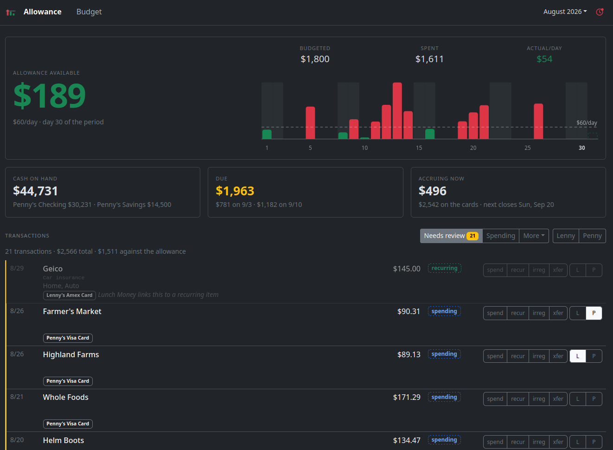
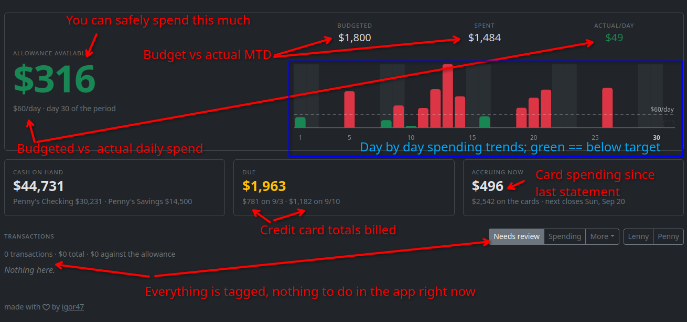
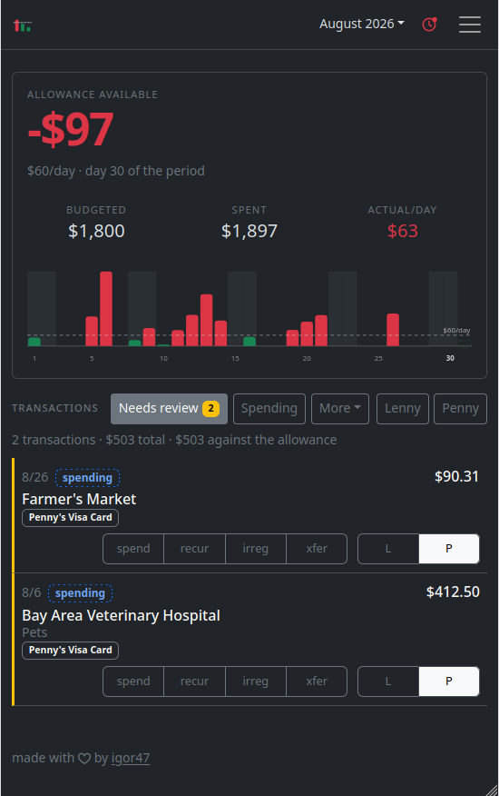
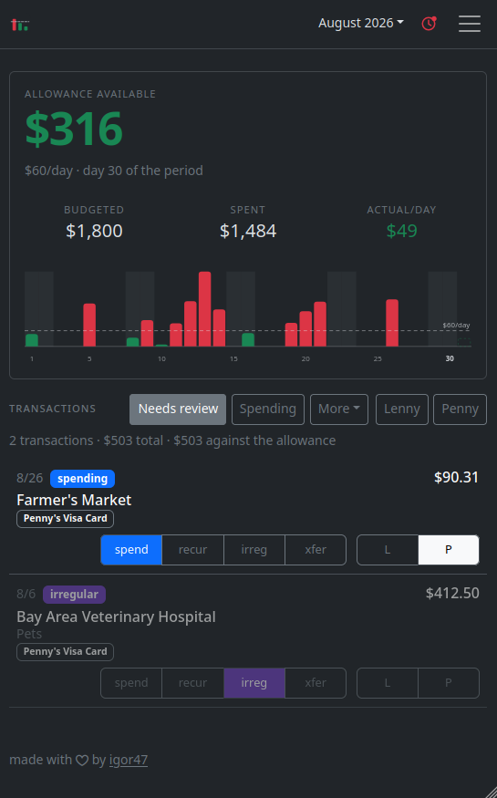
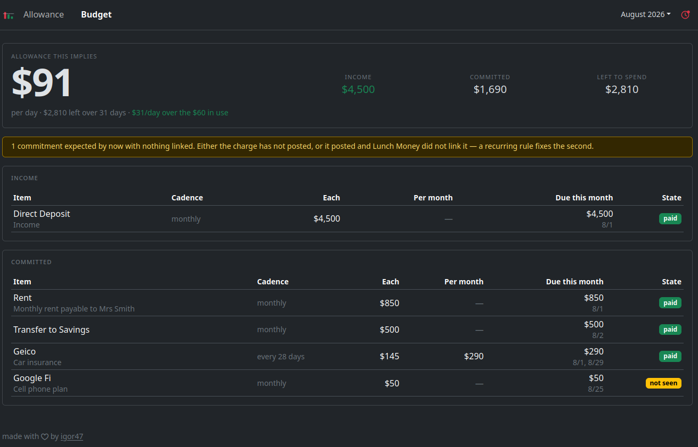
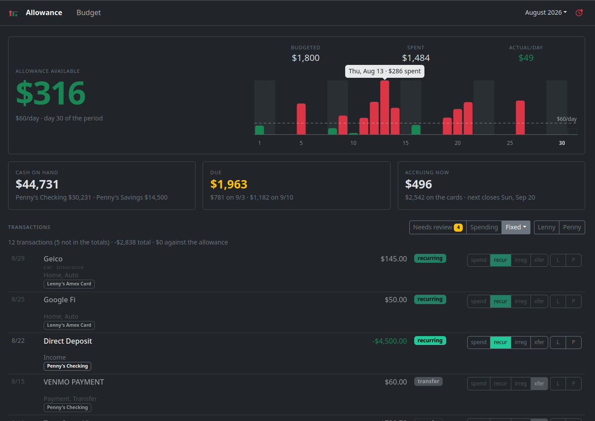
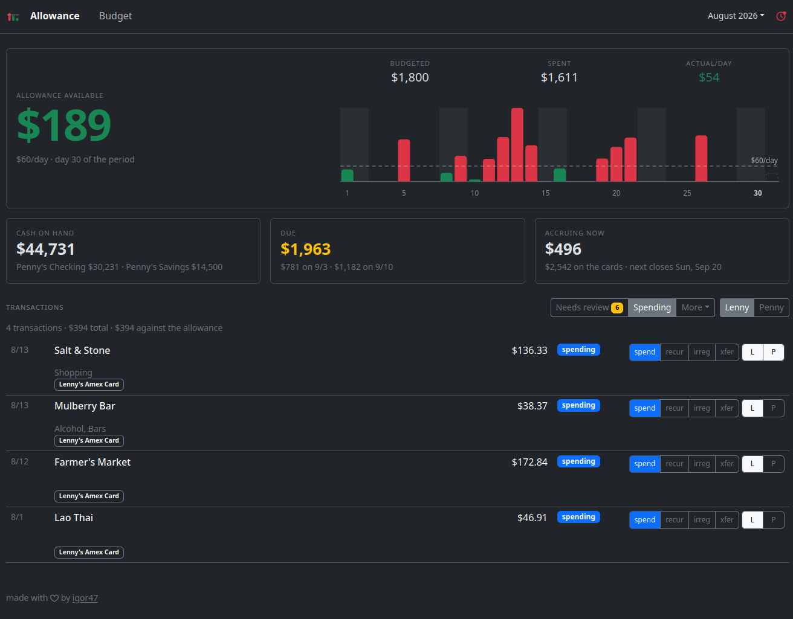
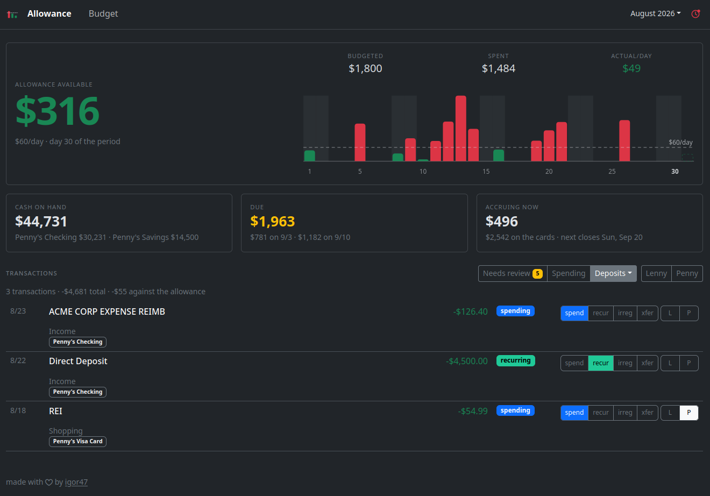

# allowance

A daily spending allowance, computed live from your [Lunch Money](https://lunchmoney.app) data.



You get one number: **how much can you spend today, and still remain on-budget**.
Every day the number goes up by your daily target and down by whatever you spent.
Unspent money rolls over (up to a cap), overspending carries forward in full, and the whole thing resets on the 1st.
I wrote about the reasoning [on my blog](https://igor.moomers.org/allowance-budget).

## Lunch Money

This app is a frontend to [Lunch Money](https://lunchmoney.app) -- there is no separate database.
Displayed transactions are read from the API, and classification is written back as transaction tags.
You can always go back to vanilla Lunch Money, and you can run this app as a persistent web service or just spin it up on your laptop for 5 minutes a day and shut it down again.

### Why Lunch Money

If you don't budget at all yet and are wondering where to start, I'd recommend Lunch Money even without this app.
Three reasons:

1. **Great API.** Covers most things in the app, [well documented](https://lunchmoney.dev), generous rate limits. This app exists because that API exists.
2. **Cheap.** $10/month, the minimum you have to pay to get reliable access to your own financial data.
3. **The [privacy policy](https://lunchmoney.app/privacy) is short and plain.** They don't sell your data and say they never will, and any AI features are opt-in.

## How `allowance` works

Three categories of money going out:

1. **Fixed** -- rent, utilities, subscriptions. Money you have to take action to *not* spend.
2. **Irregular** -- vet bills, dental, the car. You don't budget for these; you have savings for them.
3. **Spending** -- groceries, restaurants, that shirt, the concert. Everything else.

Only the third category counts against the allowance.
The app decides which transactions are spending using two things: the account a transaction is on, and the tags on it.

**Accounts have a default.**
On a `spending` account (your credit card), an untagged transaction counts.
On a `fixed` account (your checking account), an untagged transaction does not -- rent and the autopay come out of there, and counting them would blow up the number.
The default per-account is specified in [the config file](#2-the-config-file).

**Tags override the default.**
The app writes these tags to Lunch Money, and reads them back:

| Tag | Meaning | Counts against allowance? |
|---|---|---|
| `spending` | discretionary, explicitly | yes |
| `recurring` | a fixed expense | no |
| `irregular` | a lumpy one-off | no |
| `transfer` | money moved between your own accounts | no |
| *(none)* | not reviewed yet | depends on the account |

You don't need to create the tags; they're created the first time you click them.
You also don't need to review everything.
Untagged charges on the card already count, so the number is right by default and gets *more* generous as you tag things `recurring`, not less.

**Recurring transactions are detected.**
If Lunch Money has linked a charge to one of your [recurring items](#recurring-items), the app reads that link and treats the charge as `recurring` without being told.
You should still confirm it from the review list.

**Transfers are detected.**
Examples include paying the card from checking, moving money to savings, or cashing out a Venmo balance.
If both sides are in Lunch Money, the app finds the matching pair (equal and opposite amount, different accounts, within three days) and infers both.
You don't need to tag those; but if the app gets them wrong you can find them in the `All` filter and fix it.

**Card statements are tracked.**
In the config, you can tell the app which accounts are credit cards and when they close.
The dashboard will then show you your most recent balance, when it's due, and how much you've accrued on the card since then.
Multiple cards are supported.

## Usage

Open it, look at the number, tag whatever's new.
That's the whole loop, and it takes about a minute a day.

### The dashboard



### Tagging

Under the boxes is the transaction list.
Every row has the four classifying buttons -- `spend`, `recur`, `irreg`, `xfer` -- and a button per person.
Click one to set the tag, click it again to remove it.
Classifying tags are exclusive; person tags stack.

The chip on each row is what the app currently thinks the money was.
An outlined chip is the app's own guess; a filled one means a person said so.
Here are two charges nobody has looked at yet, both on the card, where untagged counts.
The month is $97 in the red:



The farmer's market really is spending, so it gets `spend`, which changes no numbers at all -- only the outline.
The vet bill is not something anybody budgets for; that's what savings are for.
Tag it `irreg` and it leaves the count:



$316 to the good, and nothing left to review.

### The budget page

The `/budget` page is your plan rather than your month -- income, minus what you've committed to, spread over the days:



It's built entirely out of Lunch Money's [recurring items](#recurring-items), so it's worth only as much as what you've put in there.
The headline is the allowance your plan implies, and it tells you when that has drifted from the `daily_target` you configured -- $91/day here against the $60 in use.
It also flags a commitment that should have landed by now and hasn't.
Maybe you cancelled the subscription, or maybe Lunch Money's linking broke?

### Filters

The buttons above the list are filters: the two you're in most of the time out front, the other four behind **More**, and the people on the right.
A state and a person stack.

**Fixed** is everything that doesn't count, with the reason next to it -- the recurring tags, the matched transfers, the paycheck:



The person filters answer "who spent it":



**Deposits** is money going the other way.
It's where a [reimbursement](#reimbursements) turns up, and where you tag it `spending` to hand the allowance back:



## Setup

Three parts: set up Lunch Money, write the config file, run the app.

### 1. Lunch Money

**Link your accounts.**
Everything you want counted needs to be in Lunch Money, ideally via Plaid so transactions arrive on their own.
A manually-managed account works too -- you'll be entering the transactions yourself, but its balance and its recurring items count like any other.

**Make an API key** on the Developers page (gear icon → Settings → Developers → New Access Token).
It needs write access, because tagging is how you classify transactions.
The key has full access to your account, so treat it like a password.
I use one key for my server and a different one for my laptop, so I can revoke either.

<a id="recurring-items"></a>
**Fill in recurring items.**
Lunch Money's [Recurring page](https://my.lunchmoney.app/recurring) is where the app gets your fixed costs and your income.
Put everything in: rent, every subscription, your paycheck (income can be a recurring item too).
Lunch Money will suggest most of them from your transaction history; you just confirm.
The `/budget` page adds these up, subtracts them from income, divides by the days in the month, and tells you what daily target your plan actually implies -- so this is how you pick the number for the config file.
It's also where you'll notice a subscription that didn't get charged this month, or one you forgot you had.
And it's what stops the app asking you about a subscription that bills to your card: Lunch Money links the charge to the item, and the app reads the link.

**Exclude "Credit card payment" from budget and totals.**
Lunch Money ships this category and files autopays into it.
Left in, it double-counts: the charges it settles were already counted on the card.
`mise run configure:lunchmoney` (below) will do this for you.

**Set up rules** so that Lunch Money assigns categories the app can key on.
Lunch Money has a [rules engine](https://support.lunchmoney.app/setup/rules) (Setup → Rules) that matches payees and sets categories or tags, and this app deliberately leans on it rather than shipping its own regexes.
For most people this is a single rule:

| If payee contains | Set category to | Why |
|---|---|---|
| `AUTOMATIC PAYMENT` (whatever your card issuer writes) | `Credit card payment` | Lunch Money usually files these correctly on its own, but every so often one arrives as "Income" -- which the app would read as a large refund crediting your allowance |

If your bank does something unusual (see [the brokerage example](#a-brokerage-checking-account-that-sweeps) below), you'll need another rule or two.

**Ask an LLM to do the audit.**
This is what I did, and I recommend it.
Put your API key in the environment, clone this repo somewhere it can see, and ask something like:

> I want to make sure my Lunch Money account is configured to work with the allowance app, whose source is in `./allowance`.
> Read its README and `allowance.example.toml`.
> My API key is in `LUNCHMONEY_API_KEY`; the API is documented at https://lunchmoney.dev.
> Look at my accounts, categories, recurring items and the last three months of transactions, and tell me what needs to happen in Lunch Money, plus a draft `allowance.toml`.
> Don't modify anything.

I ran exactly that against a fresh demo account with Claude's mid-tier model and it came back with the missing category, the two payee strings the rules needed, which card the autopay actually lands on (I had guessed wrong), a subscription billing to a spending card that would need a `recurring` tag, and a daily target sized from three months of real spend.
Then you make the rules by hand in Lunch Money, because the rules have no API.

### 2. The config file

Copy [`allowance.example.toml`](allowance.example.toml) to `allowance.toml` and edit it.
The example file is commented heavily and is worth reading in full; this section walks through it.

```toml
daily_target = 75          # dollars per day
period_start = "2026-08-01" # the day you started; earlier days are ignored
rollover_cap_days = 14     # unspent money banks up to 14 days' worth
history_start = "2025-01"  # how far back the month picker goes

[accounts."Chase Sapphire"]
policy = "spending"
statement = { close_day = 12, due_day = 9 }

[accounts."Chase Checking"]
policy = "fixed"

[categories]
card_payment = ["Credit card payment"]
```

That is a complete config for one person with a checking account and a credit card.

**The top-level numbers.**
`daily_target` is the allowance.
`rollover_cap_days` limits how much unspent allowance you can bank -- a frugal two weeks can fund a nice dinner, but not a vacation.
Overspending is not capped; if you're $500 in the hole, you're $500 in the hole.
`period_start` is the day the app starts counting, and only matters in its own month.
`history_start` is the earliest month the month picker offers, since asking the API "when does my data start" would burn through the rate limit.

**Accounts.**
Each account is keyed by its *display name in Lunch Money*, matched exactly.
An account that shows up in your transactions but isn't in this table is treated as `fixed` and listed on the dashboard as unknown, so a typo is visible rather than silently changing the math.
There are three policies:

* `spending` -- an untagged transaction counts. Your credit card, your Venmo balance, your cash account.
* `fixed` -- an untagged transaction does not count; only a `spending` tag does. Your checking and savings accounts. ATM withdrawals get tagged `spending` by hand.
* `ignore` -- never counts, never shown. A closed card, a mortgage account, your kid's account.

The expensive mistake is marking a bank account `spending`.
Rent and the card payment come out of it, and both would count.

Any number of accounts may carry `statement` -- two people usually hold a card each rather than sharing one.
Those are the cards whose billing cycles drive the summary boxes.
`close_day` is the day of the month the statement closes and `due_day` is the day of the *following* month the autopay hits.
If you don't have a card, or don't care, leave it off everywhere and the allowance still works.

**Categories.**
This is where the app is told which Lunch Money categories mean "money moved" rather than "money spent".
Names must match Lunch Money exactly, including the emoji Lunch Money loves to prefix categories with (`🔄 Payment, Transfer`).
All three lists are optional:

* `card_payment` -- a payment against a card balance, on either side. Lunch Money ships "Credit card payment", so you probably want exactly what's above.
* `internal_transfer` -- a bank's bookkeeping against itself. Most people leave this empty; see the brokerage example.
* `suggests_transfer` -- categories that *hint* a transaction is a transfer, without being sure. These never drop a transaction on their own; they only help confirm a matched pair. `["Payment, Transfer"]` is the usual value.

Once the file is written, reconcile Lunch Money against it:

```
$ mise run configure:lunchmoney          # prints a plan
$ APPLY=1 mise run configure:lunchmoney  # creates missing categories, excludes them from budget/totals
```

It creates any category you named that doesn't exist and flips the exclude-from-budget switch on it.
It also refuses to run if you wrote `Payment, Transfer` and Lunch Money has `🔄 Payment, Transfer`, and tells you what to paste.

**People.**
Optional.
Add a `[[people]]` entry per person and every transaction gets a button to attribute it to them.
This is purely for the "who spent it" filter; it never changes the number.

```toml
[[people]]
tag = "alex"
label = "Alex"

[[people]]
tag = "sam"
label = "Sam"
```

The per-row button shows the first letter of the label; add `short = "Sa"` if two names collide.

### 3. Run it

**On your laptop:**

```
$ cp allowance.example.toml allowance.toml   # and edit it
$ mise run setup
$ LUNCHMONEY_API_KEY=... mise run dev        # http://localhost:3005
```

You need [mise](https://mise.jdx.dev/) (which installs [bun](https://bun.sh)), or bun on its own and read the commands out of `mise.toml`.

This is a perfectly good way to use the app.
There's no state on disk, so nothing is lost when you close the terminal, and your tags are in Lunch Money for next time.
Open it once a day, tag the last few transactions, look at the number.

**On a server:**

CI builds `ghcr.io/igor47/allowance` on every tagged release.
The image is stateless -- no volume, nothing to back up.

```
$ docker run -p 3000:3000 \
    -e LUNCHMONEY_API_KEY=... \
    -v /path/to/allowance.toml:/app/allowance.toml:ro \
    ghcr.io/igor47/allowance:1.1.0
```

Pin a version rather than `:latest`.

**The app has no login.**
If you put it on the internet, it *must* sit behind something that authenticates the request -- I use [authentik](https://goauthentik.io/) as a forward-auth provider for traefik.
The proxy injects the username as a header (`X-authentik-username` by default; set `AUTH_USER_HEADER` for something else), and the app uses it for the access log.
Make sure the proxy strips that header from incoming requests, or anyone can claim to be anyone.
For traefik, that's `underscoreHeadersStrategy: delete` on the entrypoint.

**Environment variables:**

| Variable | Default | |
|---|---|---|
| `LUNCHMONEY_API_KEY` | -- | **required** |
| `ALLOWANCE_CONFIG` | `./allowance.toml` | path to the config file |
| `PORT` | `3005` (`3000` in the image) | |
| `DISPLAY_TZ` | `America/Los_Angeles` | what "today" means |
| `CACHE_TTL_SECONDS` | `300` | how long API responses are held; the API allows 100 requests/minute per IP |
| `REFRESH_AFTER_MINUTES` | `30` | how old the data can be before the dashboard offers a refresh |
| `AUTH_USER_HEADER` | `X-authentik-username` | where the username comes from |

The split is deliberate: everything about *your money* is in the file, everything about *the deployment* is in the environment, and nothing is settable in both.

## Examples

Each of these builds on the basic config above.

### Two people, a card each

The most common household setup.
You have a card each, the paycheck lands in a joint checking account, and you want to see who spent what.

```toml
daily_target = 150
period_start = "2026-08-01"
rollover_cap_days = 14
history_start = "2025-06"

[[people]]
tag = "alex"
label = "Alex"

[[people]]
tag = "sam"
label = "Sam"

[accounts."Alex's Card"]
policy = "spending"
statement = { close_day = 20, due_day = 15 }

[accounts."Sam's Card"]
policy = "spending"
statement = { close_day = 12, due_day = 9 }

[accounts."Joint Checking"]
policy = "fixed"

[accounts."Joint Savings"]
policy = "fixed"

[categories]
card_payment = ["Credit card payment"]
suggests_transfer = ["Payment, Transfer"]
```

Nothing else changes.
The person tags are written to Lunch Money like any other tag, so if Sam tags a transaction from their phone it shows up for Alex.
A transfer from checking to savings is matched automatically and drops out of both.

The two cards close on different days, which the summary boxes handle by adding up the money and keeping the dates separate: Due lists a figure per due date rather than averaging two dates into a lie.
The one thing never added up is the reconciliation, which reports a line per card -- summing them would let a card that's $200 overstated cancel one that's $200 understated and report agreement.

### Cash and ATM withdrawals

An ATM withdrawal is a debit on the checking account, which is `fixed`, so by default it doesn't count.
Tag it `spending` and it does.
If you use cash a lot, this is the one manual step you'll do regularly.

If you'd rather track a cash account in Lunch Money as a manual account, mark it `spending` and enter what you spend there; then the ATM withdrawal becomes a transfer *into* it and gets matched.

### Venmo, or any wallet app

Wallet apps are the case that can't be solved with a rule, and it's worth understanding why.

Suppose you pay $40 to Venmo from checking.
If your Venmo balance is also in Lunch Money, that's a transfer: the $40 shows up in Venmo, you spend it from there, and the app matches the two legs.
If Venmo is *not* in Lunch Money, that same bank row is the only record of the spend that will ever exist, and it should count.
Same payee, same category, opposite meaning.

So the app doesn't guess.
Those rows land in the review list, and you tag them: `transfer` if the money went somewhere you track, `spending` if it didn't.

My recommendation is to link the wallet.
Then mark it `spending` in the config:

```toml
[accounts."Venmo"]
policy = "spending"
```

Money you send from the Venmo balance counts; money that arrives from checking is matched as a transfer.
The one gap is a cashout with a fee: an instant transfer that takes 1.5% doesn't match to the cent, so it falls through to review.
That's on purpose -- the app would rather ask than silently drop money.

### A brokerage checking account that sweeps

Some brokerages (Fidelity, Schwab) offer a cash management account that keeps its balance in a money-market fund.
Every real deposit or withdrawal arrives *paired with* a bookkeeping row -- "REDEMPTION FROM CORE" or similar -- moving money in or out of the fund.
Both rows look like transactions to Plaid.
Both come through with the same generic category.

The fix is one Lunch Money rule and one config line:

1. In Lunch Money, make a rule: payee contains `CORE` (or whatever yours says) → category `Internal sweep`.
2. In `allowance.toml`:

```toml
[accounts."Fidelity CMA"]
policy = "fixed"

[categories]
card_payment = ["Credit card payment"]
internal_transfer = ["Internal sweep"]
```

Run `mise run configure:lunchmoney` to create the category.
Rows filed under it are dropped as bank bookkeeping, on any account.

This is the kind of thing an LLM will spot for you when you let it look at three months of transactions.
I wouldn't have known to look for it otherwise.

### Reimbursements

You put a $300 work dinner on the card; it counts against your allowance.
Two weeks later a $300 reimbursement lands in checking.
Checking is `fixed`, so the deposit is ignored by default.

Tag the deposit `spending`.
A negative spending amount credits the allowance, and you're back to even.
This is the reason `spending` is the one tag that overrides everything else -- it's the escape hatch.

### No credit card

Debit card only, or you just don't want the statement view:

```toml
[accounts."Checking"]
policy = "spending"
```

Yes, this marks a bank account `spending`, which I told you not to do.
It's fine if *nothing but discretionary spending* leaves the account -- but if rent comes out of it too, make a Lunch Money rule that tags the rent payee `recurring` (rules can add tags, not just categories), and it never shows up in review again.
Leave `statement` off everywhere; the dashboard just won't show the card boxes.

## Developing

Everything you can do to the repo is a `mise` task:

```
$ mise tasks
setup                  Install dependencies and vendor front-end assets
dev                    Dev server with hot reload
preview                Serve the app over a synthetic world, for looking at the UI (no API)
check                  Lint + typecheck
check:fix              Auto-fix lint/formatting, then typecheck
test                   Run tests (offline; never touches the Lunch Money API)
image                  Build the container image locally, as CI does on a push
configure:lunchmoney   Reconcile Lunch Money's categories to allowance.toml; dry run unless APPLY=1
smoke                  One-shot live API fetch + print, to eyeball real numbers (manual only)
```

`mise run preview` runs the app over a synthetic household with no API key, which is how to look at the UI without spending your rate limit.

Tests are offline and entirely synthetic -- there's no recorded data in the repo.
A test builds a *world* (accounts, transactions, today's date) and asserts what the page should say:

```ts
const world = aWorld({ today: "2026-08-14" })
  .account(CARD, { balance: "1200.00" })
  .charge({ on: "2026-08-03", amount: 100, payee: "A Grocer" })
  .autopay({ on: "2026-08-09", amount: 1000, from: CHECKING })

const page = await dashboard(world)
expect(page.hero).toBe("$2,700")
```

The Lunch Money v2 API is in alpha and the client in `src/lunchmoney/` is the only thing that knows its shapes.
[`CLAUDE.md`](CLAUDE.md) has the design notes: why inclusion is per-account, how transfer matching works, and the traps in the recurring-items API.

## Licence

MIT. See [LICENSE](LICENSE).
